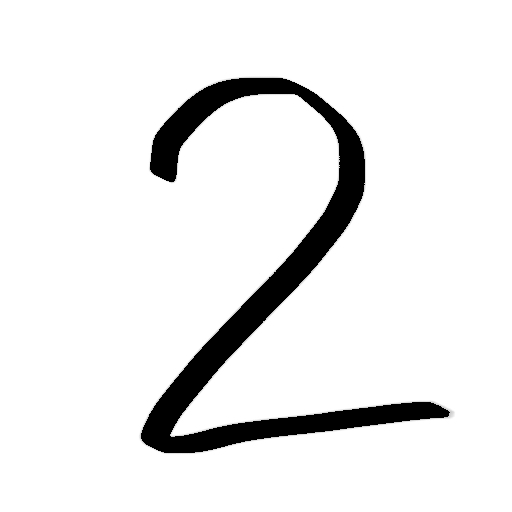

# numrec
This is my take on handwritten number recognition. This is an exercise for me, so I did not use any external sources to figure out the logic of the algorithm.

THIS IS A WORK IN PROGRESS


## Usage

```bash
python3 main.py [inputPic]
```

## What does the algorithm do?

<div style="text-align:center;">
    
    
    
    
</div>

The pics are not to scale.
